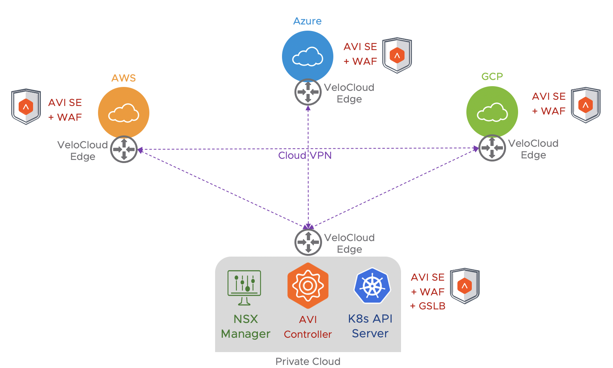

# Virtual Cloud Networking (VCN) DEMO

This example is for DEMO purpose ONLY.

This repository provides terraform script to demo VMware Virtual Cloud Networking (VCN) including:

1- Velocloud SD-WAN for Cloud VPN connectivity between private cloud and public cloud

	1.1 - Two (2) cloud subnets will be created in AWS, Azure and GCP with routing and firewall rules

	1.2 - The Velocloud edge instance will be deployed in the public subnet

	1.3 - A web server, based on Bitnami/nginx, will be deployed in the private subnet

	1.4 - A static route will be configured to reach the private cloud for management access

2- NSX Advanced Load Balancer (AVI networks) for multi-cloud load-balancing, WAF and GSLB

	2.1 - Two (2) AVI SEs will be deployed in the cloud private subnet
	
	2.2 - One (1) AVI VS per cloud (AWS, Azure, GCP and private cloud) with WAF enabled will be configured
	
	2.3 - One (1) GSLB service will be configured to reach the private VS (other VS associated to public cloud can be added manually)

3- SOON - NSX Datacenter for network automation and software defined firewall (micro-segmentation, IDS/IPS)

	3.1 - in progress	

NOTE: Before to start, be sure that you understand the terraform files and provide the following requirements.

# REQUIREMENTS

----- GENERAL -----

	1- Use the "terraform.tfvars" to specify all required credentials
	
	2- For each cloud, you will find a folder that define a terraform module. In each of them, you can customize variables in "variables.tf" file
	
	3- If you want to demo one specific public cloud (for example GCP), please comment (by using /* ... */ other modules in the "main.tf" and "outputs.tf" files
	

----- Velocloud SD-WAN -----

	1- Create an Edge profile and configuration on Velocloud Orchestrator (VCO)

	2- Provide the Activation Code AND the VCO address in the "cloud-init-<CLOUD>" file

NOTE: Every time you create or recreate the VeloCloud Virtual Edge in a public cloud, you have to generate a new Activation Code OR via RMA process

----- NSX Advanced Load Balancer (AVI networks) -----

	1- For the private cloud, a web server VM or container has to be deployed manually in the vSphere environment.
	
	2- Customize the AVI parameters (VS name, domain-name, IP servers, pool name, ...) in the "variables.tf" file for each folder
	
	3- Because the GSLB service is only associated to the private cloud via automation, all GSLB variables are under the vSphere folder.

----- NSX Datacenter -----

	In progress...

At the end of execution, SSH private key for each Virtual Edge and Web VM will be provided.

# EXECUTION

To setup demo, execute the "tfapply.sh" script (again: be sure that you understand the terraform files and provide the requirements)

# DESTROY

Before to execute the "tfdestroy.sh" script in order to destroy the demo environment, I recommend the following steps:

	1- Disable the AVI Virtual Services (under AVI UI -> Applications -> Virtual Services)
	
	2- Delete AVI SEs (under AVI UI -> Infrastructure -> Service Engines)
	
	3- Execute the "tfdestroy.sh" script

Enjoy !
